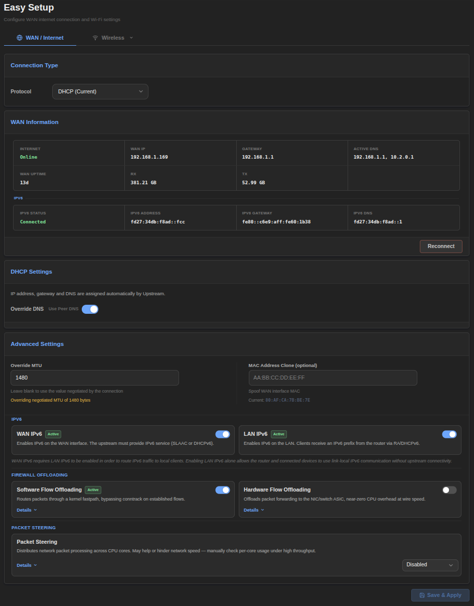
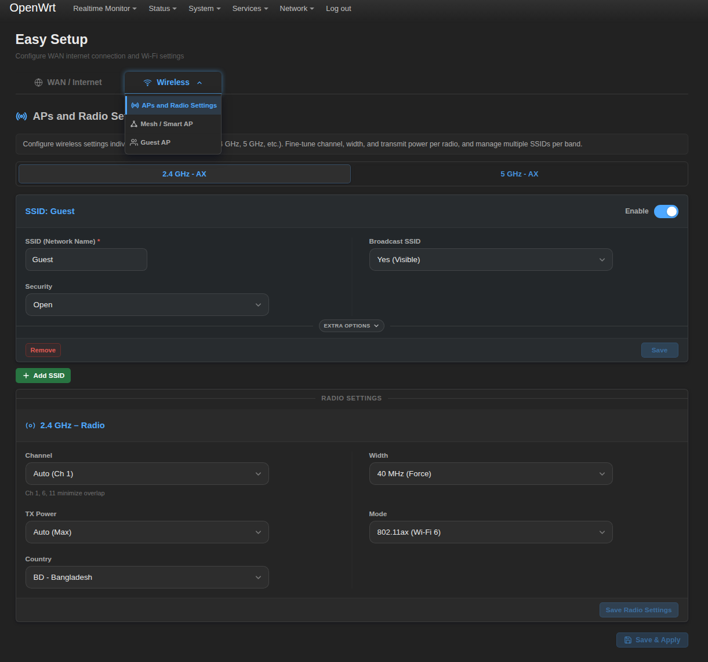

# luci-app-easy-setup (Initial Release)

`luci-app-easy-setup` is a modern, user-friendly LuCI application for OpenWrt designed to simplify network and wireless configuration. It provides a clean, responsive interface that makes managing your router's core features easy and intuitive.

---

## Installation

Choose the installation method based on your OpenWrt version:

### For OpenWrt v25.12 or newer (.apk)
Run the following command in your router's terminal to download and install the `.apk` package:

#### Using wget (Standard)
```bash
apk update && wget --no-check-certificate -O /tmp/luci-app-easy-setup-1.0.0-r1.apk https://github.com/OppsError404/luci-app-easy-setup/releases/download/initial-release/luci-app-easy-setup-1.0.0-r1.apk && apk add --allow-untrusted /tmp/luci-app-easy-setup-1.0.0-r1.apk && rm /tmp/luci-app-easy-setup-1.0.0-r1.apk
```

#### Using curl (Alternative)
```bash
apk update && curl -L -o /tmp/luci-app-easy-setup-1.0.0-r1.apk https://github.com/OppsError404/luci-app-easy-setup/releases/download/initial-release/luci-app-easy-setup-1.0.0-r1.apk && apk add --allow-untrusted /tmp/luci-app-easy-setup-1.0.0-r1.apk && rm /tmp/luci-app-easy-setup-1.0.0-r1.apk
```

### For OpenWrt v24.10.5 or older (.ipk)
Run the following command in your router's terminal to download and install the `.ipk` package:

#### Using wget (Standard)
```bash
opkg update && wget --no-check-certificate -O /tmp/luci-app-easy-setup_1.0.0-r1.ipk https://github.com/OppsError404/luci-app-easy-setup/releases/download/initial-release/luci-app-easy-setup_1.0.0-r1.ipk && opkg install /tmp/luci-app-easy-setup_1.0.0-r1.ipk && rm /tmp/luci-app-easy-setup_1.0.0-r1.ipk
```

#### Using curl (Alternative)
```bash
opkg update && curl -L -o /tmp/luci-app-easy-setup_1.0.0-r1.ipk https://github.com/OppsError404/luci-app-easy-setup/releases/download/initial-release/luci-app-easy-setup_1.0.0-r1.ipk && opkg install /tmp/luci-app-easy-setup_1.0.0-r1.ipk && rm /tmp/luci-app-easy-setup_1.0.0-r1.ipk
```

---

## Uninstallation

Choose the uninstallation method based on your OpenWrt version:

### For OpenWrt v25.12 or newer (.apk)
```bash
apk del luci-app-easy-setup
```

### For OpenWrt v24.10.5 or older (.ipk)
```bash
opkg remove luci-app-easy-setup
```

---

## Navigating the page
  - Open luci then -> `Network/Easy Setup`

## Key Features

- **🎨 Modern Responsive UI**: 
  - Clean, card-based layout.
  - Full support for **Dark and Light themes**.
  - Optimized for both desktop and mobile browsers.

- **🌐 Quick WAN Configuration**:
  - **Real-time Status**: Visual indicators for internet connectivity and WAN port carrier status.
  - **Easy Setup**: Quickly switch between **DHCP, Static IP, and PPPoE**.
  - **Advanced Tools**: MAC address cloning, MTU adjustment, and custom DNS settings.
  - **One-Click Reconnect**: Easily restart your WAN connection.

- **📶 Unified Wireless Management**:
  - **Multi-Band Support**: Manage 2.4GHz, 5GHz, and 6GHz radios from a single dashboard.
  - **Smart AP / Mesh**: Simplified configuration for seamless roaming (802.11k/v/r) and band steering.
  - **Detailed Control**: Fine-tune HT modes (up to EHT80/160), channels (including DFS), and transmit power.

- **👥 Isolated Guest Network**:
  - One-click creation of a secure Guest AP.
  - Automatic isolation from the LAN.
  - Automated firewall and DHCP subnet configuration.

- **⚡ Performance Optimization**:
  - Toggle **Hardware and Software Flow Offloading**.
  - Configure **Packet Steering** for multi-core CPU efficiency.

---

## Requirements
- OpenWrt LuCI Support
- `luci-compat`

---

## Screenshots




---
*Created by OppsError404*
